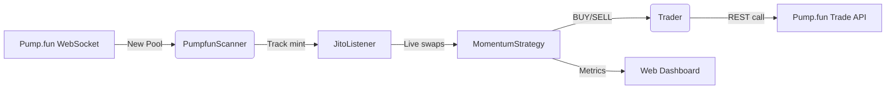

# Sol Sniper Bot

> Real-time momentum sniper for Pump.fun launches on Solana


## Table of Contents
1. [Features](#features)
2. [Prerequisites](#prerequisites)
3. [Installation](#installation)
4. [Configuration](#configuration)
5. [Quick Start](#quick-start)
6. [Architecture](#architecture)
7. [Strategy](#strategy)
8. [Docker](#docker)
9. [Roadmap](#roadmap)
10. [Contributing](#contributing)
11. [License](#license)
12. [Disclaimer](#disclaimer)

---

## Features
- ⛏️ **Pump.fun pool sniffer** – detects every new token launch within ~1 second.
- ⚡ **Ultra-low-latency prices** via Jito Geyser gRPC stream.
- 📈 **Momentum entry**: buy after *momentum_buy_pct* rise from local low (default +50 %).
- 🔄 **Adaptive exits**: trailing ATR & TPS, plus configurable `take_profit` / `stop_loss`.
- 🦺 **Safety filters**: liquidity, dev-wallet sells, transfer-fee, bundler program, etc.
- 🧠 Optional **LightGBM** ML signals for smarter entries/exits.
- 🖥️ Local **dashboard** to monitor pools, positions & PnL.
- 📝 Starts in **paper-trading** mode; flip a flag to go live.

## Prerequisites
- **Node.js ≥ 18** with npm/yarn/pnpm.
- A reliable **Solana RPC** endpoint (Helius, Triton, …).
- (Live only) Wallet private key in base58 *or* Solana-CLI array.
- (Live only) **Jito Geyser access token** (get one at <https://jito.network/>).

## Installation
```bash
# Clone the repo
git clone https://github.com/<your-gh-user>/sol-sniper-bot.git
cd sol-sniper-bot

# Install dependencies
npm install    # or pnpm / yarn

# Create your secret & config files
cp .env.example .env              # template
cp config.example.yaml config.yaml
```

## Configuration
1. **.env** – secrets only  
   ```env
   WALLET_PRIVATE_KEY="..."   # optional while paper=true
   RPC_URL="https://api.mainnet.helius.xyz/?api-key=..."
   GEYSER_AUTH="..."          # Jito Geyser token
   TELEGRAM_TOKEN="..."       # optional
   TELEGRAM_CHAT_ID="..."
   ```

2. **config.yaml** – strategy parameters  
   ```yaml
   # === Core ===
   momentum_buy_pct: 0.5        # +50 % from local low
   take_profit: 0.9             # +90 % PnL
   stop_loss: 0.15              # -15 % PnL
   min_initial_mcap: 5          # SOL in curve
   token_max_age: 600           # seconds after launch
   trade_size_sol: 1

   # === Pump.fun trade endpoint ===
   pump_api:
     url: "https://pumpportal.fun/api/trade"
     slippage: 3
     priority_fee: 0.0002       # SOL
     paper: true                # false = live
     use_jito: true
     jito_endpoint: "https://mainnet.block-engine.jito.wtf/api/v1/transactions"
     jito_auth: "${GEYSER_AUTH}"

   # === Optional ML ===
   lgbm_enabled: false
   lgbm_model_dir: "models"
   ```

## Quick Start
```bash
# Run in hot-reload (defaults to paper-trading)
npm run dev

# Production build
npm run build && npm start
```

## Architecture



**Data flow explained**
1. **PumpfunScanner** subscribes to `wss://pumpportal.fun` and emits every new token pool.
2. **JitoListener** listens to Solana confirmed transactions via Jito Geyser gRPC to derive real-time prices.
3. **MomentumStrategy** maintains state, applies momentum & risk filters, and triggers `BUY` / `SELL`.
4. **Trader** executes trades through Pump.fun REST or, for lowest latency, Jito Block-Engine relay (optional).
5. Signals & prices feed the local dashboard on port `3000`.

---

## Strategy
The bot follows a **momentum / micro-structure** approach designed for the Pump.fun bonding-curve model:

| Phase | Logic |
|-------|-------|
| **Discovery** | `PumpfunScanner` catches a new pool creation (`create` tx) &rarr; liquidity, dev wallet, ticker captured. |
| **Tracking** | `JitoListener` streams swaps on that mint at sub-second latency. State is updated every trade. |
| **Entry (BUY)** | Conditions:<br/>• Price has risen by `momentum_buy_pct` (+50 % default) from the **lowest** observed price.<br/>• Liquidity within `[min_initial_mcap, max_initial_liquidity]`.<br/>• Dev wallet sold at least once *(optional)*.<br/>• Risk checks passed (no high transfer-fee, bundler flag, etc.). |
| **Exit (SELL)** | Adaptive combination:<br/>• Hard `take_profit` / `stop_loss`.<br/>• ATR × `atr_mult` volatility trail.<br/>• Trailing draw-down that widens with TPS & gains.<br/>• TPS collapse and EMA cross as early-warning. |
| **Execution** | Orders sent via Pump.fun REST or Jito Block-Engine for ultra-low latency; defaults to **paper-trading**. |

---

## Docker
```bash
docker compose up --build -d
```

## Roadmap
- [ ] Advanced Telegram notifications (PNL, errors).
- [ ] Pool health & developer analytics.
- [ ] Historical back-tester & dataset exporter.
- [ ] Full unit test suite.

## Contributing
PRs are welcome! Feel free to open an issue or submit a pull request.

## License
Released under the **MIT** license – see `LICENSE` for details.

## Disclaimer
**This software is provided for educational purposes only. Crypto-currency trading is risky – you use this bot at your own responsibility.**

